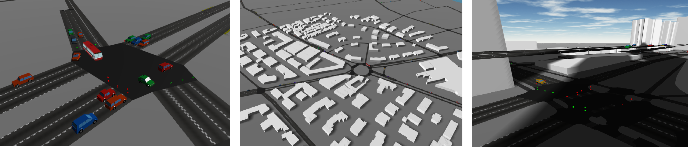
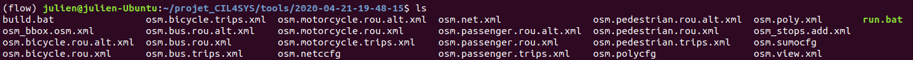

**
SUMO tools
**

 Find here some additional tools for SUMO </a> 

# SUMO-Web3D

Allow the visualization of [SUMO][] in 3D in a web browser using TraCI and three.js.

## Setup

SUMO-Web3D is available on PyPI:

    pip install sumo-web3d
    sumo-web3d
    # then open http://localhost:5000 in your browser

You'll need to have SUMO installed and the `SUMO_HOME` environment variable set.

To run your own simulations, use the `-c` command line argument:

    sumo-web3d -c path/to/your/simulation.sumocfg

## Usage

When you start `sumo-web3d`, it runs `sumo` as a subprocess and starts your simulation.

You can interact with the visualization using the mouse or the keyboard:

- Mouse
    - Click and drag to pan around the visualization.
    - Right-click and drag to rotate.
    - Use the mouse wheel to zoom in and out.
- Keyboard
    - `h`/`l` or `a`/`d` pan the camera left and right
    - `j`/`k` or `w`/`s` move the camera forward or backward
    - `↑`/`↓` rotate the camera up or down
    - `←`/`→` rotate the camera left and right
    - `ctrl` + `↑`/`↓` move the camera up and down

You can send valid arguments and flags to the SUMO executable.

    sumo-web3d --sumo-args '--scale 10 --step-length 0.1'

* `--scale 10`:
    Increase the number of vehicles defined in the route file by 10x.
* `--step-length 0.1`:
    Each frame should advance by 0.1s, rather than the default of 1s. This results in smoother animation.

## Development

SUMO-Web3D is written in Python (Python3) and TypeScript.

To get going, we recommend setting up a Python virtual environment:

    python -m venv $name_of_virtual_environment
    source $name_of_virtual_environment/bin/activate

Then install both Python and JS dependencies:

    pip install -r requirements.txt
    yarn

Download SUMO following the OS-specific [build instructions][downloading] in the SUMO documentation. Note that pre-compiled downloads exist for Windows and Linux, but Mac users will likely have to download and compile their own binaries. If you're a Mac user, watch out for any yellow "this is broken, do something else" messages to save some time.

After downloading SUMO, you'll need to declare the installation directory as an environment variable (`$SUMO_HOME`) so the generation scripts have access to the tools included with your installation. To do this, include a line such as the following to your `~/.bash_profile` (adjust it depending on your path and directory name):

    export SUMO_HOME=$HOME/git/sumo-0.31.0

### Up and Running

Build the client-side JavaScript bundle:

    yarn webpack

Run the server:

    python sumo_web3d/sumo_web3d.py

Then visit http://localhost:5000/ to view the built-in scenarios.

If you want to load a specific SUMO configuration, use the `-c` flag:

    python sumo_web3d/sumo_web3d.py -c path/to/your/scenario.sumocfg

If you'd like to iterate on the frontend code, run:

    yarn develop

instead of `yarn webpack` and `python sumo_web3d/sumo_web3d.py`.

### Run to visualize Flow
First do 

`python flow/visualize/visualizer_rllib.py "path-to-pkl-file" "checkpoint num" --run "Algorithm" --num_rollouts "num_rollouts"`--sumo_web3d

and then run 

`python sumo_web3d/sumo_web3d.py --sumo-port "port_num" -c 
"path to sumo.cfg"`

Flow will print out a statement indicating a port which has 2 clients open on it.
Alternately, you can get the port num by running "ps aux | grep sumo" and picking the one with num-clients = 2

### Adding a new scenario to the server

You can add custom SUMO simulations to appear in the scenario dropdown. In order to so, you must update the `scenarios.json` file with the required information. Any scenario must have a name that (when hyphen-cased) is unique from all the others. The scenario must also have a valid path to the `.sumocfg` file.

    [
        {
            "name": "pedestring striping",
            "description": "Demonstration of pedestrian congestion in crosswalks",
            "config_file": "tests/pedestrian-striping/test.sumocfg"
        },
        {
            "name": "person_number",
            "description": "Demonstration of a person gettin on and off the bus",
            "config_file": "tests/person_number/person_number.sumocfg"
        }
    ]

[sumo]: http://sumo.dlr.de/wiki/SUMO_User_Documentation
[downloading]: http://sumo.dlr.de/wiki/Developer/Main#Build_instructions
[xquartz]: https://www.xquartz.org/
[sumobuild]: https://github.com/planetsumo/sumo#build-and-installation
[extract]: https://mapzen.com/data/metro-extracts/metro/toronto_canada/101735835/Toronto/
[osmconvert]: http://wiki.openstreetmap.org/wiki/Osmconvert
[design-doc]: https://docs.google.com/document/d/1JTLETGdZMA2y8b9HGhedPcYFg6SQ4NSqdXtSmFKIlkI/edit

# OSMWebWizard

The OSM Web Wizard offers one of the easiest solutions to start with SUMO. Based on a selection of an openstreetmap map excerpt, you will be able to configure a randomized traffic demand and run and visualize the scenario in the [SUMO-GUI](https://sumo.dlr.de/docs/SUMO-GUI.html). This tutorial will guide you step by step from the selection of the map excerpt over defining the traffic demand through running and visualizing the scenario in the SUMO-GUI.

## Getting started

The OSM Web Wizard is essentially a collection of python scripts located under the directory _tools_ in your sumo installation root. You start the OSM Web wizard by invoking the following command in the _tools_ directory:

    python osmWebWizard.py

Windows users may also invoke the command by clicking _All Programs -> SUMO -> OSM Web Wizard_. Once the script is running, a web browser should open showing a map excerpt of central Berlin.

You may zoom and pan to the area of your interest. Caution: if the map excerpt covers a very large area, the simulation might become slow or even unresponsive. We suggest to choose a similar zoom level as in the initial view.

In the next step, you select the actual area for which you want to generate the simulation scenario. The area selection will be activated by clicking the check box  _Select Area_  at the blue area selection panel on the right side of the map. You can change the size and location of this area by click and hold with the mouse pointer at the boundary between the grayed and non-grayed area. Once you are satisfied with the area selection, you can proceed to the next step.

## Network Generation

The infrastructure import from OSM into the SUMO simulation are affected by different Wizard options * by default a road traffic simulation is generated but all types of roads and rails will be imported as well (cycle paths, footpaths, railways etc) * if the checkbox "left-hand Traffic" is enabled, the network will be built with left hand traffic rules. For most geographic regions where this is required, this feature will be enabled automatically but if it does not work, this option can be used as a remedy. * if the checkbox "Car-only Network" is enabled, then only roads that permit passenger car traffic will be included. This can be used to reduce the network size and also helps to reduce intersection complexity * if the checkbox "Import Public Transport" is enabled, then busStops and trainStops will be exported. Also busses, trams and trains will be generated that follow the public transport routes defined in OSM (but they will follow synthetic schedules). * if the Demand-checkbox "Bicycles" is active, then extra bicycle lanes will be added to roads where OSM contains this informatoin * if the Demand-checkbox "Pedestrians" is active, then sidewalks and pedestrian crossings will be generated

## Demand Generation

The demand is defined by the demand generation panel. You activate this panel by clicking on the car pictogram.

SUMO supports various modes of transport. At the demand generation panel, you can activate/deactivate the individual modes of transport by clicking the corresponding checkboxes. For each mode of transport, the OSM Web Wizard generates random demand based on a certain probability distribution, which is influenced by two parameters:

-   Every time a new vehicle is generated, the OSM Web Wizard randomly chooses a departure and arrival edge for the vehicle. The  _Through Traffic Factor_  defines how many times it is more likely for an edge at the boundary of the simulation area being chosen compared to an edge entirely located inside the simulation area. A big value for the  _Through Traffic Factor_  implies that many vehicles depart and arrive at the boundary of the simulation area, which corresponds to a scenario with a lot of through traffic.
-   The  _Count_  parameter defines how many vehicles are generated per hour and lane-kilometer. Assuming
    -   the network contains 3 edges with a combined length of 5 km
    -   that each has 2 lanes which allows the current traffic mode
    -   and the count value is set to 90,
    -   then 5 * 2 * 90 = 900 vehicles per hour will be generated. This translates to a  [randomTrips](https://sumo.dlr.de/docs/Tools/Trip.html#randomtripspy)  parameter of p=4 which means a new vehicle is inserted every 4 seconds somewhere in the network.

The next step is generating and running the scenario.

## Generating and Running the scenario

The complete scenario will be generated automatically once _Generate Scenario_ in the control panel has been clicked. The scenario generation takes a couple of seconds or minutes (depending, among others, on the size of the scenario). Once the scenario generation process has finished, the SUMO-GUI starts and the simulation can be started by pressing the _Play_ button.

## Where to go from here

The OSM Web Wizard stores the entire simulation scenario sumo config and intermediate files in a local directory with a name in the format of _yyyy-mm-dd-hh-mm-ss_. If your SUMO installation location is writeable, the data will be stored inside the _tools_ directory. Otherwise, a new directory _~/SUMO/yyyy-mm-dd-hh-mm-ss_ will be created to host the data. The contents of the directory look like this:

You may now edit those files and re-run the simulation. To learn more about the SUMO scenario files, please consult the other [Tutorials](https://sumo.dlr.de/docs/Tutorials.html) as well.

